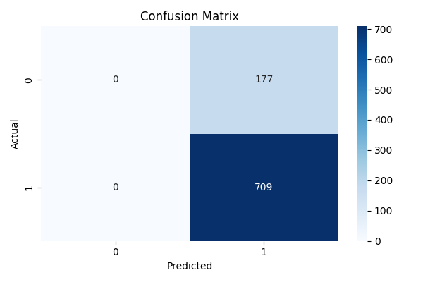
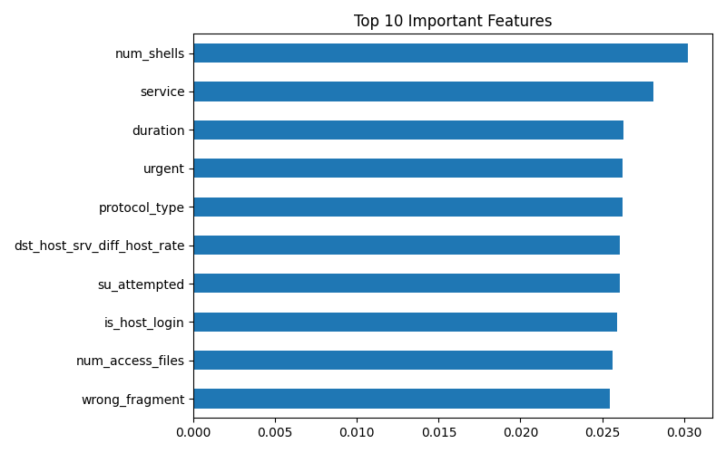

# AI Network Intrusion Detection
## Problem Statement

Modern communication networks, cloud infrastructures, and enterprise systems are continuously exposed to cyber threats such as:

- Unauthorized access attempts
- Denial-of-Service (DoS) attacks
- Malicious traffic behavior
- Exploitation of vulnerable services

Traditional rule-based security systems often rely on predefined signatures, making them less effective against evolving or unknown attack patterns.

Therefore, there is a growing need for an intelligent system that can:

Automatically analyze network traffic patterns and detect malicious behavior using machine learning techniques.

---

## Proposed Solution

This project develops a Machine Learning-based Network Intrusion Detection System (NIDS) that classifies network traffic as:

- Normal Traffic
- Malicious / Attack Traffic

The system uses the NSL-KDD benchmark cybersecurity dataset, containing real network connection features such as:

- Protocol type
- Service type
- Source bytes / Destination bytes
- Connection duration
- Error rates
- Host traffic statistics

A Random Forest Classifier is trained to learn attack patterns and distinguish suspicious traffic from legitimate connections.

---

## Methodology

The project follows a complete machine learning pipeline:

### 1. Data Preprocessing

- Load NSL-KDD dataset
- Convert labels into binary classes:

```
Normal = 0
Attack = 1
```

### 2. Model Training

A Random Forest Classifier is trained using the processed data to classify traffic behavior.

**Why Random Forest?**

- Strong performance on tabular data
- Robust to noisy features
- Interpretable through feature importance
- Efficient and reliable baseline model

### 3. Evaluation

The model is evaluated using:

- Accuracy
- Precision
- Recall
- F1 Score
- Confusion Matrix

### 4. Interpretation

Feature importance analysis is used to identify which traffic indicators contribute most to intrusion detection.

---

## Results

The system generates:

### Model Performance Metrics

Measures the quality of detection performance.

### Confusion Matrix

Shows:

- Correctly Detected Normal Traffic (True Negatives): The model successfully identified zero normal connections as "Normal"
- False Alarms (False Positives): The model took 177 legitimate, normal network connections and incorrectly flagged them as "Attack Traffic"
- Missed Attacks (False Negatives): The model did not miss a single attack
- Correctly Detected Attack Traffic (True Positives): The model successfully identified 789 malicious attempts (such as DoS or unauthorized access) as "Attack Traffic"

### Feature Importance Graph



Displays the top network features influencing predictions.

---

## Example Findings

Typical important indicators include:

- Source bytes transferred
- Destination bytes transferred
- Connection count
- Service behavior
- Error rate patterns

These are realistic signals often associated with suspicious network behavior.

---

## How to Run the Project

### Step 1: Clone Repository

```bash
git clone https://github.com/syedirfanx/ai-network-intrusion-detection.git
cd ai-network-intrusion-detection
```

### Step 2: Install Requirements

```bash
py -m pip install -r requirements.txt
```

### Step 3: Run Project

```bash
py app.py
```

---

## Output Files

After execution, the following files are generated inside `/results`:

```
results/
├── confusion_matrix.png
└── feature_importance.png
```

And trained model:

```
models/nids_model.pkl
```

---

## Real-World Applications

This system can support:

- Enterprise network monitoring
- Telecom infrastructure security
- Cloud platform anomaly detection
- Automated SOC alert systems
- Smart city / IoT security monitoring

---

## Research Relevance

This project aligns with academic and industry areas such as:

- Cybersecurity
- Intelligent Communication Networks
- Machine Learning for Security
- AI-driven Threat Detection
- Network Analytics

---

## Conclusion

This project demonstrates that machine learning can effectively detect malicious traffic patterns using structured network data.

It represents a practical step toward:

Autonomous, AI-powered cybersecurity systems capable of protecting modern digital infrastructures.

---

## Future Improvements

- Deep Learning-based IDS (LSTM / Autoencoder)
- Multi-class attack categorization
- Real-time packet stream monitoring
- Explainable AI for threat reasoning
- Integration with SIEM / SOC systems

